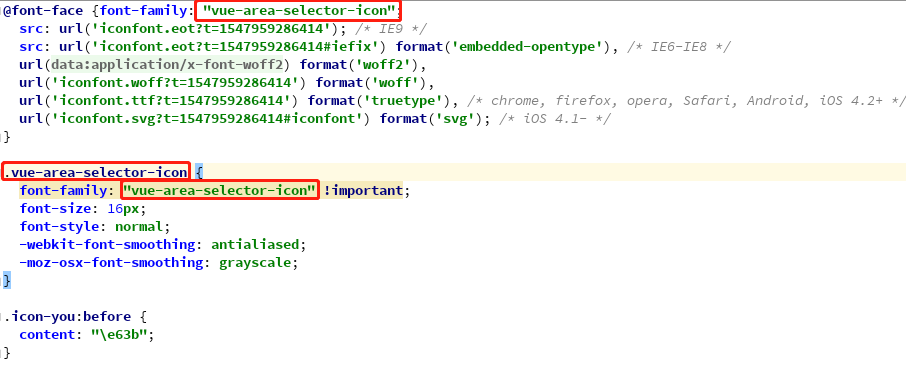

# 二次开发

- 源码目录

  ```
    │  App.vue
    │  main.js
    │
    ├─assets
    │  │ 
    │  └─iconfont   //项目用到的字体图标
    │          demo.css
    │          demo_index.html
    │          iconfont.css
    │          iconfont.eot
    │          iconfont.js
    │          iconfont.svg
    │          iconfont.ttf
    │          iconfont.woff
    │          iconfont.woff2
    │
    └─VueAreaSelector
            index.js    //组件注册
            leaf.js    //想象项目的主要逻辑为枝干，具体实现为叶子，可以把部分实现方法迁移到leaf，使主题逻辑更加清晰
            VueAreaSelector.vue   //组件
  ```
  
- 开发使用的命令
  
  ```
    //安装依赖
    npm install
    
    //开发模式运行
    npm run dev
    
    //打包组件
    npm run build-plugin
  ```
  
- 如果项目里需要替换iconfont，记得修改iconfont.css默认的family名称,例如：

  
